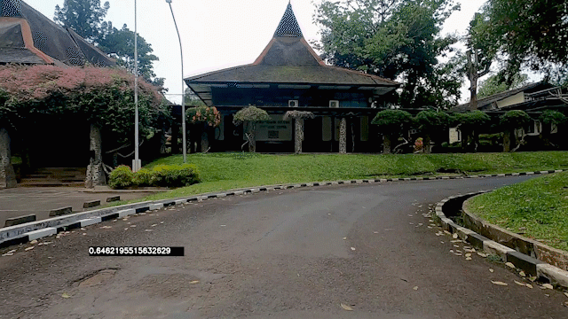
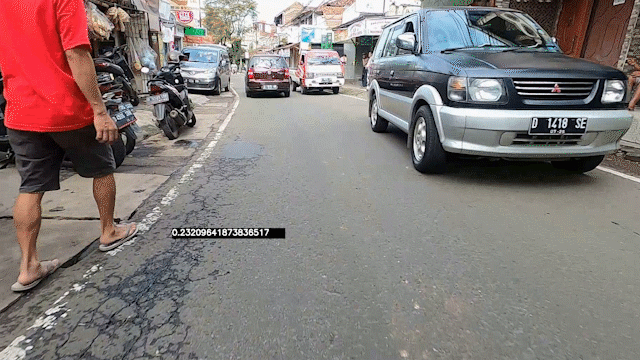

# Road-Damage-Detection
 
<h2>How to Run</h2>

 1. Set up the CUDA Toolkit and CUDNN versions that support TensorFlow-GPU version 2.7.0. You can find the installation instructions and tested build configuration at https://www.tensorflow.org/install/source#gpu.
 2. Open main.pynb
 3. Install the requirement:
 ``` 
 !pip install -r requirements.txt 
 ```
 4. Run:
 ``` 
 from pipeline_func import *
 ```
 5. Modify the input_video with the desired input video path, and change out_folder with the desired output folder name.
 ```
 print("Start") # To see the progress (if running in VSCode)

input_video = "input/1.mp4"
out_folder = "video_output"

# function definition located in pipeline_func.py file (line 498)
road_damage_detection(input_video, out_folder)
```
 6. Wait
 
 <h2>Pothole Detection</h2>
 
 <p align="center">
  
</p>

<h2> Aligator Crack Detection</h2>

<p align="center">
  
</p>

<h2> CSV Damaged Detail </h2>

<p align="center">
  
</p>
 

 

 
 
